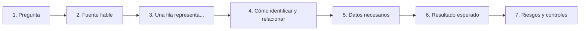

# Marco de análisis — antes de las views

[Inicio](../../README.md) → [Documentación](../README.md) → Marco de análisis

El proyecto vuelve a una base controlada: tablas madre, granularidades y calidad de datos. Todavía no hay views de consumo.

## Guía modular de views

El registro de diseño y sus cuatro ramas viven en:

```text
view_design/README.md
view_design/01_descriptive/README.md
view_design/02_diagnostic/README.md
view_design/03_predictive/README.md
view_design/04_prescriptive/README.md
```

Se comienza por el contrato común y después se avanza en ese orden. Cada README contiene preguntas, candidatas, riesgos y criterios de aceptación.

## Preguntas que deberán ramificarse

- Vista general: volumen y condiciones de lectura.
- Descriptive: precios vigentes por marketplace y valor de impresión por set.
- Diagnostic: rareza/precio de impresión y concentración de reimpresiones.
- Predictive: tendencias y variaciones entre snapshots comparables.
- Prescriptive: señales de seguimiento y casos que permanecen en revisión.
- Calidad: condición transversal que autoriza o bloquea la interpretación.

## Regla de avance

Antes de crear una view se documentará:

```text
pregunta -> tabla fuente -> grano -> PK/FK -> campos -> medida esperada -> riesgo
```



No se volverá a unir precio general con rareza mediante `card_id`.

La plantilla ampliada y la Definition of Done están en [view_design/README.md](view_design/README.md).

## Documentos de la rama

- [Análisis del JSON de origen](api_json_analysis.md)
- [Línea base de calidad](raw_data_quality_baseline.md)
- [Modelo de datos](data_model.md)
- [Registro modular de diseño de views](view_design/README.md)
