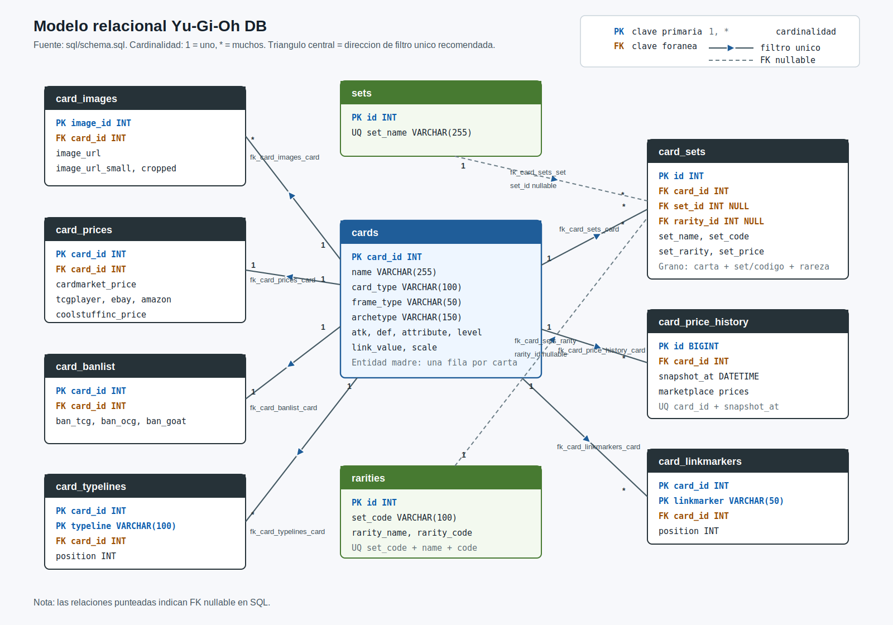
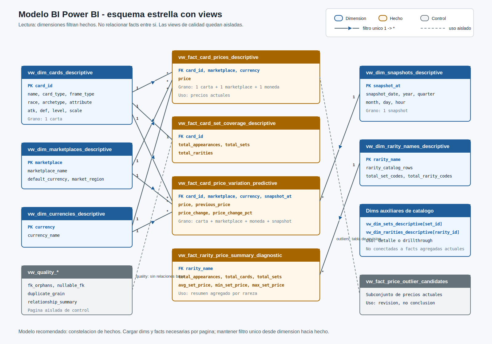

# Modelo de datos

## Objetivo

Representar la informacion de YGOPRODeck en tablas relacionales normalizadas. El esquema ejecutable vive en `sql/schema.sql`.

## Tabla principal

### `cards`

Una fila por carta.

Clave:

```text
card_id
```

## Catalogos y tablas hijas

## Diagrama relacional

Imagen generada:



```text
docs/02_marco_analisis_datos/modelo_relacional_erd.svg
```

## Esquema estrella para Power BI

Imagen generada:



```text
docs/02_marco_analisis_datos/modelo_relacional_esquema_estrella.svg
```

Lectura base:

- El modelo BI se interpreta como una constelacion de hechos, no como una estrella unica.
- Las dimensiones filtran los hechos con direccion unica `1 -> *`.
- No se recomienda relacionar tablas de hechos entre si.
- Las views `vw_quality_*` se cargan como control de calidad, aisladas del modelo analitico principal salvo necesidad puntual.

Views dimension:

```text
vw_dim_cards_descriptive
vw_dim_marketplaces_descriptive
vw_dim_currencies_descriptive
vw_dim_snapshots_descriptive
vw_dim_rarity_names_descriptive
vw_dim_sets_descriptive
vw_dim_rarities_descriptive
```

Views de hechos principales:

```text
vw_fact_card_prices_descriptive
vw_fact_card_set_coverage_descriptive
vw_fact_card_price_variation_predictive
vw_fact_rarity_price_summary_diagnostic
```

Views de control/revision:

```text
vw_fact_current_prices_diagnostic
vw_fact_price_outlier_candidates_diagnostic
vw_quality_fk_orphans_diagnostic
vw_quality_nullable_fk_diagnostic
vw_quality_duplicate_grain_diagnostic
vw_quality_relationship_summary_diagnostic
```

Relaciones recomendadas:

```text
vw_dim_cards_descriptive[card_id]
    1 -> * vw_fact_card_prices_descriptive[card_id]

vw_dim_cards_descriptive[card_id]
    1 -> 1 vw_fact_card_set_coverage_descriptive[card_id]

vw_dim_cards_descriptive[card_id]
    1 -> * vw_fact_card_price_variation_predictive[card_id]

vw_dim_marketplaces_descriptive[marketplace]
    1 -> * vw_fact_card_prices_descriptive[marketplace]

vw_dim_marketplaces_descriptive[marketplace]
    1 -> * vw_fact_card_price_variation_predictive[marketplace]

vw_dim_currencies_descriptive[currency]
    1 -> * vw_fact_card_prices_descriptive[currency]

vw_dim_currencies_descriptive[currency]
    1 -> * vw_fact_card_price_variation_predictive[currency]

vw_dim_snapshots_descriptive[snapshot_at]
    1 -> * vw_fact_card_price_variation_predictive[snapshot_at]

vw_dim_rarity_names_descriptive[rarity_name]
    1 -> * vw_fact_rarity_price_summary_diagnostic[rarity_name]
```

Nota:

- `vw_dim_sets_descriptive` y `vw_dim_rarities_descriptive` quedan como dimensiones auxiliares para detalle o drillthrough.
- La fact agregada `vw_fact_rarity_price_summary_diagnostic` debe relacionarse con `vw_dim_rarity_names_descriptive`, porque su grano es `1 rarity_name`.
- `vw_fact_price_outlier_candidates_diagnostic` es subconjunto de revision; no debe sustituir a `vw_fact_card_prices_descriptive`.

Lectura base:

- `cards` es la tabla madre. Su `card_id` alimenta todas las tablas de detalle.
- Cardinalidad del diagrama: `1` significa uno y `*` significa muchos.
- `card_prices` y `card_banlist` usan `card_id` como PK y FK; conceptualmente son relaciones `cards 1 -> 1`, aunque la fila hija puede no existir para todas las cartas.
- `card_images`, `card_price_history`, `card_typelines`, `card_linkmarkers` y `card_sets` admiten varias filas por carta; por eso son `cards 1 -> *`.
- `sets` y `rarities` son catalogos reutilizables para `card_sets`.
- `card_sets.set_id` y `card_sets.rarity_id` son nullable; la aparicion puede existir aunque el catalogo asociado no quede resuelto.

Lectura para Power BI:

- Filtro recomendado por defecto: unico desde el lado `1` hacia el lado `*`.
- `cards -> card_sets`, `cards -> card_images`, `cards -> card_price_history`, `cards -> card_typelines` y `cards -> card_linkmarkers`.
- `cards -> card_prices` y `cards -> card_banlist` como filtro unico desde `cards` hacia la tabla de detalle.
- `sets -> card_sets` y `rarities -> card_sets` como filtro unico desde catalogo hacia apariciones.
- Filtro cruzado/bidireccional: no se recomienda como regla base. Usarlo solo si el informe necesita que una tabla de hechos/puente filtre de vuelta a la dimension.
- FK nullable no significa relacion desactivada en DAX. En SQL solo permite `NULL`; en Power BI una relacion inactiva es una configuracion del modelo y se invoca en medidas con `USERELATIONSHIP`.

### `sets`

Catalogo de sets.

Relacion:

```text
sets.id -> card_sets.set_id
```

### `rarities`

Catalogo de rarezas por codigo de impresion.

Relacion:

```text
rarities.id -> card_sets.rarity_id
```

### `card_sets`

Apariciones de cartas en sets.

Grano:

```text
1 fila = 1 carta + 1 set/codigo + 1 rareza
```

Relaciones:

```text
cards.card_id -> card_sets.card_id
sets.id -> card_sets.set_id
rarities.id -> card_sets.rarity_id
```

Regla:

```text
set_price pertenece a card_sets.
```

### `card_images`

Imagenes asociadas a cartas.

```text
cards.card_id -> card_images.card_id
```

### `card_prices`

Precios actuales por carta y marketplace.

```text
cards.card_id -> card_prices.card_id
```

Regla de moneda:

```text
cardmarket_price   -> EUR
tcgplayer_price    -> USD
ebay_price         -> USD
amazon_price       -> USD
coolstuffinc_price -> USD
```

Aviso: cualquier consulta de consumo debe conservar o declarar la moneda. Si se comparan marketplaces, primero debe convertirse moneda o segmentarse el resultado.

### `card_price_history`

Snapshots de precios por ejecucion del ETL.

```text
cards.card_id -> card_price_history.card_id
```

Aplica la misma regla de moneda que en `card_prices`.

### `card_banlist`

Estado de banlist por carta.

```text
cards.card_id -> card_banlist.card_id
```

### `card_typelines`

Elementos de typeline por carta.

```text
cards.card_id -> card_typelines.card_id
```

### `card_linkmarkers`

Marcadores Link por carta.

```text
cards.card_id -> card_linkmarkers.card_id
```

## Criterio de carga

- `cards`, `card_images`, `card_prices` y `card_banlist`: insercion/actualizacion.
- `sets` y `rarities`: catalogos reutilizables.
- `card_price_history`: inserta snapshot por ejecucion real.
- `card_sets`, `card_typelines` y `card_linkmarkers`: se refrescan por carta.
