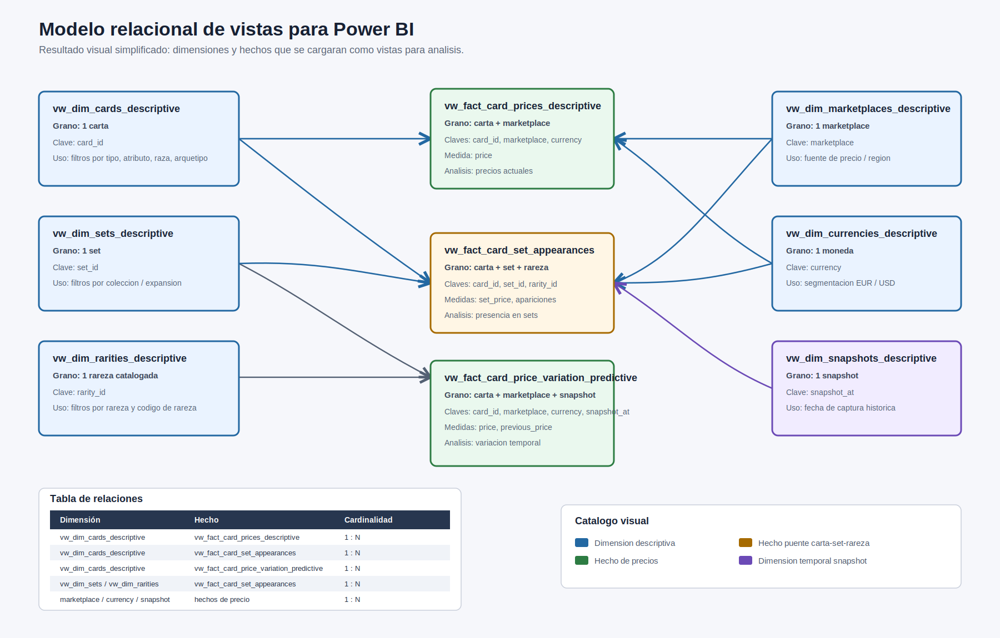

# Modelo de datos

## Objetivo

Representar la informacion de YGOPRODeck en tablas madre normalizadas y publicar un modelo `vw_` reducido para Power BI.

El esquema ejecutable de tablas vive en:

```text
sql/schema.sql
```

El modelo de vistas para analisis vive en:

```text
docs/modelo_relacional.svg
```

## Modelo Power BI basado en views

Imagen final:



Lectura base:

- El modelo Power BI se interpreta como una constelacion simplificada de hechos.
- Las dimensiones filtran los hechos con direccion unica `1 -> *`.
- No se relacionan hechos entre si.
- Los resumenes, rankings y outliers se calculan en Power BI desde hechos base.

## Views dimension

```text
vw_dim_cards_descriptive
vw_dim_sets_descriptive
vw_dim_rarities_descriptive
vw_dim_marketplaces_descriptive
vw_dim_currencies_descriptive
vw_dim_snapshots_descriptive
```

## Views de hechos

```text
vw_fact_card_prices_descriptive
vw_fact_card_set_appearances
vw_fact_card_price_variation_predictive
```

## Relaciones recomendadas

```text
vw_dim_cards_descriptive[card_id]
    1 -> * vw_fact_card_prices_descriptive[card_id]
    1 -> * vw_fact_card_set_appearances[card_id]
    1 -> * vw_fact_card_price_variation_predictive[card_id]

vw_dim_sets_descriptive[set_id]
    1 -> * vw_fact_card_set_appearances[set_id]

vw_dim_rarities_descriptive[rarity_id]
    1 -> * vw_fact_card_set_appearances[rarity_id]

vw_dim_marketplaces_descriptive[marketplace]
    1 -> * vw_fact_card_prices_descriptive[marketplace]
    1 -> * vw_fact_card_price_variation_predictive[marketplace]

vw_dim_currencies_descriptive[currency]
    1 -> * vw_fact_card_prices_descriptive[currency]
    1 -> * vw_fact_card_price_variation_predictive[currency]

vw_dim_snapshots_descriptive[snapshot_at]
    1 -> * vw_fact_card_price_variation_predictive[snapshot_at]
```

## Tabla principal

### `cards`

Una fila por carta.

Clave:

```text
card_id
```

## Catalogos y tablas hijas

### `sets`

Catalogo de sets.

Relacion:

```text
sets.id -> card_sets.set_id
```

### `rarities`

Catalogo de rarezas por codigo de impresion.

Relacion:

```text
rarities.id -> card_sets.rarity_id
```

### `card_sets`

Apariciones de cartas en sets.

Grano:

```text
1 fila = 1 carta + 1 set/codigo + 1 rareza
```

Regla:

```text
set_price pertenece a card_sets.
```

### `card_prices`

Precios actuales por carta y marketplace.

Regla de moneda:

```text
cardmarket_price   -> EUR
tcgplayer_price    -> USD
ebay_price         -> USD
amazon_price       -> USD
coolstuffinc_price -> USD
```

### `card_price_history`

Snapshots de precios por ejecucion del ETL.

Aplica la misma regla de moneda que `card_prices`.

## Criterio de carga

- `cards`, `card_images`, `card_prices` y `card_banlist`: insercion/actualizacion.
- `sets` y `rarities`: catalogos reutilizables.
- `card_price_history`: inserta snapshot por ejecucion real.
- `card_sets`, `card_typelines` y `card_linkmarkers`: se refrescan por carta.
